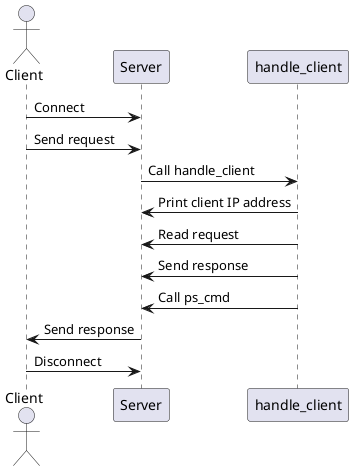

httpd.c 파일은 간단한 HTTP 서버를 구현합니다. 주요 내용은 다음과 같습니다:

## 헤더 파일 포함:

- 표준 라이브러리 헤더 파일 (stdio.h, stdlib.h, string.h, unistd.h, sys/socket.h, netinet/in.h, arpa/inet.h)
- 사용자 정의 헤더 파일 (ps_cmd.h)

## 상수 정의:

- PORT 상수는 서버가 리스닝할 포트를 정의합니다 (8080).

## 함수 정의:

- void handle_client(int client_socket): 클라이언트 요청을 처리하는 함수입니다. 클라이언트의 IP 주소를 출력하고, 요청을 읽어 "Hello, World!" 응답을 보냅니다. 또한, ps_cmd 함수를 호출하여 추가 작업을 수행합니다.
- int httpd_main(): 서버의 메인 함수입니다. 소켓을 생성하고, 바인딩하고, 리스닝하며, 클라이언트 연결을 수락하고 handle_client 함수를 호출하여 클라이언트를 처리합니다.

## 주요 함수 요약

### handle_client:

- 클라이언트의 IP 주소를 출력.
- 클라이언트 요청을 읽고, "Hello, World!" 응답을 보냄.
- ps_cmd 함수를 호출하여 추가 작업 수행.

### httpd_main:

- 소켓 생성, 바인딩, 리스닝.
- 클라이언트 연결을 수락하고 handle_client 함수 호출.

이 파일은 기본적인 HTTP 서버의 기능을 수행하며, 클라이언트의 요청을 처리하고 간단한 응답을 보냅니다.

